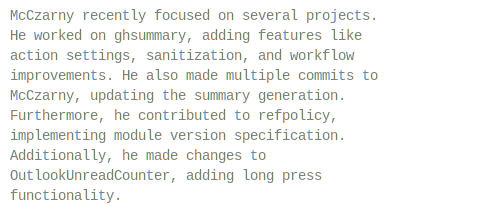

# ghsummary

`ghsummary` is a Go-based application that fetches and summarizes GitHub user activity. It provides a simplified view of recent activities for a given GitHub username.

## GitHub action

The repository provides a GitHub action to use the app for SVG file generation that can be included in a README.md file.

Example of a workflow:
https://github.com/McCzarny/McCzarny/blob/master/.github/workflows/generate-summary.yml

And its usage in a README.md file:
https://github.com/McCzarny/McCzarny/blob/master/README.md?plain=1

```markdown
[...]
**Recent activity**


[...]
```

## Usage

Run the application with the following command:
```shell
go run app/main.go --username <github-username> [--output <output-path>] [--max-events <max-events>] [--mode <mode>] ]
```

## Action inputs
| Input         | Description                                                           | Default              |
|---------------|-----------------------------------------------------------------------|----------------------|
| `username`    | GitHub username to fetch activity for                                 | No default           |
| `output_path` | Path to save the SVG file                                             | `github-summary.svg` |
| `max-events`  | Maximum number of events to summarize                                 | `100`                |
| `api_key`     | API key for GEMINI API as it is currently the only supported API      | `""`                 |
| `mode`        | 'fast' or 'strict'. Strict mode in addition looks into commit content | `fast`               |
| `pronouns`    | Pronouns to use for the user in the summary (e.g. he/him, she/her, they/them) | `he/him`             |

## Example output


